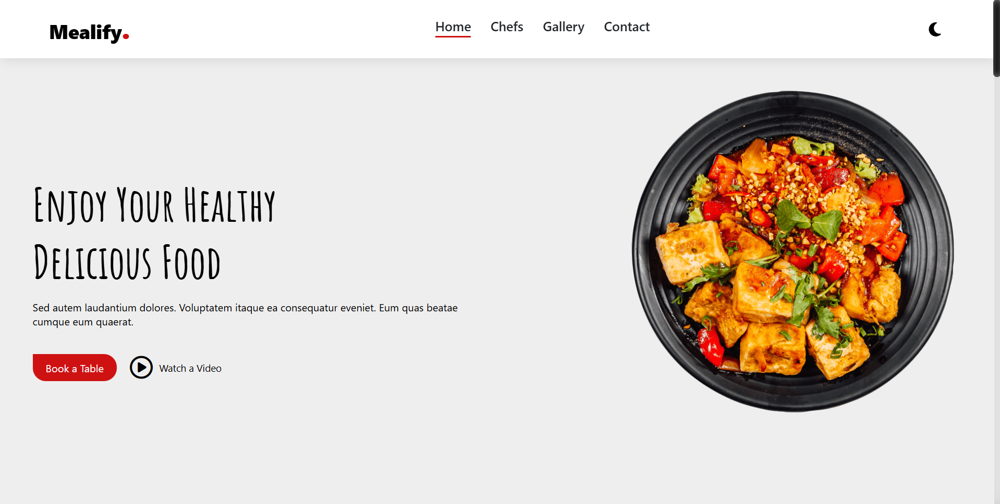

# 🍽️ Mealify – Your Culinary Journey Starts Here

 with a real screenshot of your live website for better visual impact!*

---

## 📚 Table of Contents

- 📖 About the Project
- ✨ Features
- 🛠️ Technologies Used
- 📦 Installation
- 🚀 Usage
- [� Contributing
- 📄 License
- 📬 Contact

---

## 📖 About the Project

**Mealify** is a sleek, responsive, and visually captivating landing page tailored for restaurants and culinary businesses. 🍜  
It’s designed to:

- Attract potential customers  
- Showcase your unique offerings  
- Introduce your talented team  
- Provide essential contact info  

Built with a focus on user experience and aesthetic appeal, Mealify delivers a delicious digital first impression. 😋

---

## ✨ Features

- 🧭 **Responsive Navigation Bar** – Sticky and intuitive across all devices.
- 🦸‍♂️ **Hero Section** – Eye-catching intro with CTA buttons and animated visuals.
- 👨‍🍳 **Chefs Showcase** – Highlight your culinary team with style.
- 🖼️ **Dynamic Image Gallery** – Interactive hover effects to spotlight your dishes.
- 📍 **Contact Info** – Address, email, phone, hours + embedded map.
- 🎨 **Interactive Elements** – Smooth scrolling, hover effects, and animations.
- 🧾 **Footer Section** – Quick links, social media, newsletter, and more.

---

## 🛠️ Technologies Used

- 🧱 **HTML5** – Structure and semantic layout.
- 🎨 **CSS3** – Styling, responsiveness, and animations.
- ⭐ **Font Awesome** – Iconography.
- 🔤 **Google Fonts** – Custom typography (`Amatic SC`).
- ⚙️ **JavaScript** – Minimal use for navigation link activation.

---

## 📦 Installation

No backend setup needed! Just follow these steps to run locally:

1. 🔁 **Clone the repository:**
    ```bash
    git clone https://github.com/YOUR_USERNAME/Mealify.git
    ```
2. 📂 **Navigate to the project folder:**
    ```bash
    cd Mealify
    ```
3. 🌐 **Open the website:**
    Open `index.html` in your favorite browser.

---

## 🚀 Usage

Once opened in your browser, you can:

- 🧭 Navigate through sections (Home, Chefs, Gallery, Contact)
- 👀 Explore chef profiles and gallery
- 📝 Fill out the contact form
- 📅 Click "Book a Table" or "Watch a Video" (if implemented)

---

## 🤝 Contributing

Contributions make the open-source world amazing! 🌍  
Feel free to fork, enhance, and submit a pull request. Every bit helps!

⭐ Don’t forget to star the repo if you like it!

---

## 📄 License

Distributed under the MIT License.

---

## 📬 Contact

**[Ahmed Tamer Sameer]**  
📧 ahmedssacount404@gmail.com
